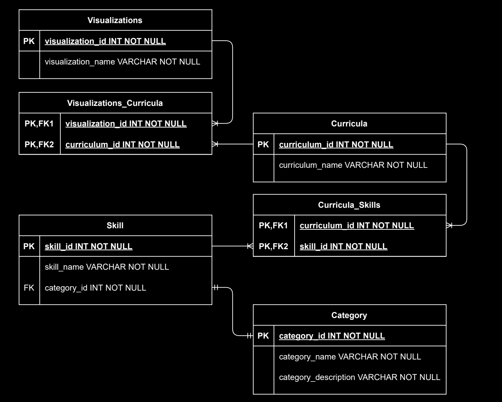

# Curricula Visualization Tool

[Go to Visualization Tool server code repo](https://github.com/bach-tran-batch-1006/visualization-tool-server)

[Go to Visualization Tool client code repo](https://github.com/bach-tran-batch-1006/visualization-tool-client)

## Table of Contents
* [Overview](#Overview)
    - [Project Description](#Description)
* [Front End Application](#Front-End-Application)
    - [View Page](#View-Page)
    - [Edit Pages](#Edit-Pages)
        - [Edit Skills and Categories](#Edit-Skills-and-Categories)

# Overview

## Description
The Curricula Visualization Tool is used, at a high-level, to provide a color-coded visualization for Revature Sales Representatives to showcase the various skills a certain curriculum (i.e. a batch) has learned through the course of their Revature Training Program. Each visualization is representative of various curricula and the skills they are familiar with. Each skill belongs to a category. Obviously, keeping track of which technologies each curriculum has been trained on can be a daunting task -  that is why we have provided the ability to dynamically add, remove, and edit different skills, categories, and curricula to fit the needs suited at any point in time.

## Technologies Used
- Spring Boot
- Hibernate
- Angular
- Junit
- Selenium
- Maven
- H2 database
- Logback

## Features
- Displays Curriculum in orgonized tabs
- Skills highlight if they were added to a certain curriculum


# Front End Application

## View Page
include screenshot maybe

## Edit Pages

### Edit Skills and Categories
include screenshot here

talk about each of the buttons on the page and their function


### Edit Curricula
include screenshot here

talk about each of the buttons on the page and their function

### Edit Visualizations
include screenshot here

talk about each of the buttons on the page and their function

## Testing
Talk about Jasmine and Protractor


---
# Back End API

## Endpoints
List out the endpoints
Show off the json responses
List possible status codes
State the verb
The below bit of code shows getting a visualization by it's id, change for the other endpoints
```json
{
    "visualizationId": 1,
    "visualizationName": "First Visualization",
    "curriculumList": [
        {
        "curriculumId": 1,
            "curriculumName": "Java with Automation",
            "skillList": [
                {
                    "skillId": 33,
                    "skillName": "Angular",
                    "category": {
                        "categoryId": 33,
                        "categoryName": "Client-Side Technologies",
                        "categoryDescription": "Tools developers can leverage to build front-end web applications"
                    }
                }
            ]
        }
    ]
}
```

## Models
List the models for hibernate

## Controller Layer
Talk about endpoint handling and logging

## Service Layer
Talk about general error checking

## Dao Layer

Talk about Spring Data JPA

## Testing
Talk about JUnit and Mockito


