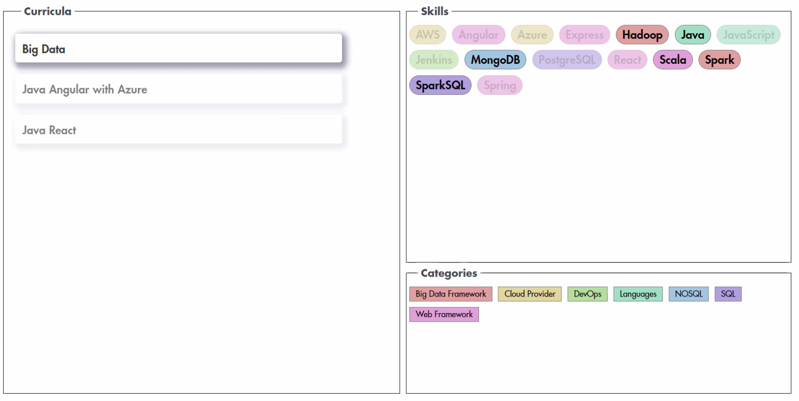
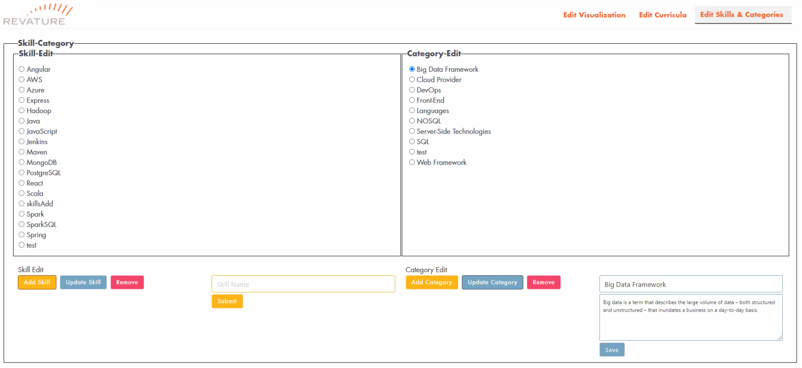
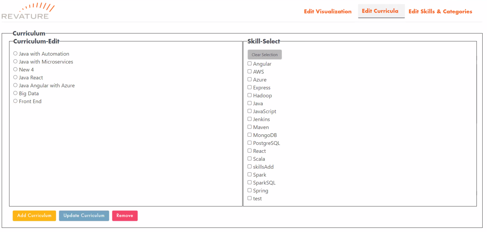

# Curricula Visualization Tool


[Go to Visualization Tool server code repo](https://github.com/bach-tran-batch-1006/visualization-tool-server)


[](https://sonarcloud.io/dashboard?id=bach-tran-batch-1006_visualization-tool-server)


[Go to Visualization Tool client code repo](https://github.com/bach-tran-batch-1006/visualization-tool-client)


[](https://sonarcloud.io/dashboard?id=bach-tran-batch-1006_visualization-tool-client)


## Table of Contents
* [Overview](#Overview)
    - [Project Description](#Description)
* [Front End Application](#Front-End-Application)
    - [View Page](#View-Page)
    - [Edit Pages](#Edit-Pages)
        - [Edit Skills and Categories](#Edit-Skills-and-Categories)
        - [Edit Curricula](#Edit-Curricula)
        - [Edit Visualizations](#Edit-Visualizations)
    - [Front End Testing](#Front-End-Testing)
        - [Jasmine](#Jasmine)
        - [Protractor](#Protractor)
* [Back End API](#Back-End-API)
    - [Sample Outputs](#Sample-Outputs)
    - [Endpoints](#Endpoints)
    - [Models](#Models)
    - [Controller Layer](#Controller-Layer)
    - [Service Layer](#Service-Layer)
    - [Dao Layer](#Dao-Layer)
    - [Back End Testing](#Back-End-Testing)

# Overview

## Description
The Curricula Visualization Tool is used, at a high-level, to provide a color-coded visualization for Revature Sales Representatives to showcase the various skills a certain curriculum (i.e. a batch) has learned through the course of their Revature Training Program. Each visualization is representative of various curricula and the skills they are familiar with. Each skill belongs to a category. Obviously, keeping track of which technologies each curriculum has been trained on can be a daunting task -  that is why we have provided the ability to dynamically add, remove, and edit different skills, categories, and curricula to fit the needs suited at any point in time.

## Technologies Used
- Spring Boot
- Spring Data JPA
- Hibernate
- Angular
- Bulma
- Junit
- Mockito
- Protractor
- Maven
- H2 database
- Logback

## Features
- Displays Curriculum in orgonized tabs
- Skills highlight if they were added to a certain curriculum


# Front End Application

## View Page
Representation of a Visualization object. Allows users to click on a curriculum and view a list of skills that the curriculum teaches. Skills are highlighted based on if the curriculum teaches that skill, and every skill is color coded based on the category.




## Edit Pages

### Edit Skills and Categories
Allows users to create, update, and delte skills and categories. Each skill requires a category to be linked to it, but a category can be created independently of the skills. The "add" and "update" buttons toggle their respective input fields in order to create a new object or to update an existing one. Back end is only called after clicking the "submit" or "save" buttons below the input fields. Clicking on a skill will also cause the update field to toggle on. The "remove" button deletes the currently selected skill from the database unless there is an issue with the deletion (like dependencies), in which case and error message is displayed to the user.




### Edit Curricula
Allows users to create, update, and delete curricula. Each curricula contains a list of skills that can be taught by a specific curriculum. Users can pick a curriculum from the left side and update what skills are taught by that curriculum by selecting skills from the checklist on the right and clicking the update button. Add and Remove function identically to skills and categories.



### Edit Visualizations
Allows users to create, update, and delete visualizations. Each visualization contains a list of curricula to be shown to Revature clients. Users can pick a visualization from the left side and update what curricula from the checklist on the right should be shown on the visualization view page by clicking the update button. Add and Remove function identically to skills and categories.


## Front End Testing
### Jasmine
The front end service files were tested through the use of Jasmine. Utilizing Jasmine, the project achieved _____% code coverage of the service layer.

Code coverage can be further explored via SonarCloud [here](https://sonarcloud.io/dashboard?id=bach-tran-batch-1006_visualization-tool-client)


### Protractor
The front end was also tested utilizing Protractor. Protractor was able to simulate a user interacting with the various edit pages, it was able to test adding, updating, and deleting visualizations, curricula, skills, and categories by automatically selecting the elements on the page and filling data in the input fields.

To run the tests, open git bash and run the command `ng e2e`.


---
# Back End API

## Sample Outputs
### Visualization Object
```json
{
    "visualizationId": 1,
    "visualizationName": "First Visualization",
    "curriculumList": [
        {
        "curriculumId": 1,
            "curriculumName": "Java with Automation",
            "skillList": [
                {
                    "skillId": 33,
                    "skillName": "Angular",
                    "category": {
                        "categoryId": 33,
                        "categoryName": "Client-Side Technologies",
                        "categoryDescription": "Tools developers can leverage to build front-end web applications"
                    }
                }
            ]
        }
    ]
}
```
### Curriculum Object
```JSON
{
    "curriculumId": 1,
    "curriculumName": "Java with Automation",
    "skillList": [
        {
            "skillId": 33,
            "skillName": "Angular",
            "category": {
                "categoryId": 33,
                "categoryName": "Client-Side Technologies",
                "categoryDescription": "Tools developers can leverage to build front-end web applications"
            }
        }
    ]
}
```

### Skill Object
```JSON
{
    "skillId": 33,
    "skillName": "Angular",
    "category": {
        "categoryId": 33,
        "categoryName": "Client-Side Technologies",
        "categoryDescription": "Tools developers can leverage to build front-end web applications"
    }
}
```

### Category Object
```JSON
{
    "categoryId": 2,
    "categoryName": "Language",
    "categoryDescription": "Programming Languages"
}
```

## Endpoints

## `/visualization`
**Verb:** GET

**Response Format:** application/json

**Status Codes:**
- 200: OK

**Response:** Array of all [visualization objects](#Visualization-object) stored in the database. If the database is empty, it just returns an empty array.


## `/visualization/{id}`
**Verb:** GET

**Response Format:** application/json

**Status Codes:**
- 200: OK
- 400: Non-integer/Empty ID
- 404: No visualization found for given ID

**Response:** Returns a [visualization object](#Visualization-object) specified by the ID. If the ID is not found, it will return a 404 error and if the user provides an unparsable ID, it will return a 400 error.


## `/visualization`
**Verb:** POST

**Input Format:** application/json (automatically formatted by front end application)

**Response Format:** application/json

**Status Codes:**
- 200: OK
- 400: Empty Name given for the new visualization

**Response:** Adds a new [visualization object](#Visualization-object) to the database and returns the created visualization. If the user sends information to create the new visualization but leaves the name blank, it will return a 400 error.


## `/visualization/{id}`
**Verb:** PUT

**Input Format:** application/json (automatically formatted by front end application)

**Response Format:** application/json

**Status Codes:**
- 200: OK
- 400: Non-integer/Empty ID, Empty Name given for the updated visualization
- 404: No visualization found for given ID

**Response:** Updates a visualization object already stored in the database and returns the updated [visualization object](#Visualization-object). If the user sends information to update the visualization but leaves the name blank, it will return a 400 error. If the ID is not found, it will return a 404 error and if the user provides an unparsable ID, it will return a 400 error.


## `/visualization/{id}`
**Verb:** DELETE

**Response Format:** int

**Status Codes:**
- 200: OK
- 400: Non-integer/Empty ID
- 404: No visualization found for given ID

**Response:** Deletes a visualization from the database with the ID provided by the user and returns the ID of the deleted visualization upon success. If the ID is not found, it will return a 404 error and if the user provides an unparsable ID, it will return a 400 error.


## `/visualization/{id}/skills`
**Verb:** GET

**Response Format:** application/json

**Status Codes:**
- 200: OK
- 400: Non-integer/Empty ID
- 404: No visualization found for given ID

**Response:** Returns list of all the unique [skills](#Skill-Object) held by the visualization specified by the ID provided by the user. If the ID is not found, it will return a 404 error and if the user provides an unparsable ID, it will return a 400 error.


## `/visualization/{id}/categories`
**Verb:** GET

**Response Format:** application/json

**Status Codes:**
- 200: OK
- 400: Non-integer/Empty ID
- 404: No visualization found for given ID

**Response:** Returns list of all the unique [category objects](#Category-Object) held by the visualization specified by the ID provided by the user. If the ID is not found, it will return a 404 error and if the user provides an unparsable ID, it will return a 400 error.


## `/curriculum`
**Verb:** GET

**Response Format:** application/json

**Status Codes:**
- 200: OK

**Response:** Array of all [curriculum objects](#Curriculum-Object) stored in the database. If the database is empty, it just returns an empty array.


## `/curriculum/{id}`
**Verb:** GET

**Response Format:** application/json

**Status Codes:**
- 200: OK
- 400: Non-integer/Empty ID
- 404: No curriculum found for given ID

**Response:** Returns a [curriculum object](#Curriculum-Object) specified by the ID. If the ID is not found, it will return a 404 error and if the user provides an unparsable ID, it will return a 400 error.


## `/curriculum`
**Verb:** POST

**Input Format:** application/json (automatically formatted by front end application)

**Response Format:** application/json

**Status Codes:**
- 200: OK
- 400: Empty Name given for the new curriculum

**Response:** Adds a new curriculum object to the database and returns the created [curriculum object](#Curriculum-Object). If the user sends information to create the new curriculum but leaves the name blank, it will return a 400 error.


## `/curriculum/{id}`
**Verb:** PUT

**Input Format:** application/json (automatically formatted by front end application)

**Response Format:** application/json

**Status Codes:**
- 200: OK
- 400: Non-integer/Empty ID, Empty Name given for the updated curriculum
- 404: No curriculum found for given ID

**Response:** Updates a [curriculum object](#Curriculum-Object) already stored in the database and returns the updated curriculum. If the user sends information to update the curriculum but leaves the name blank, it will return a 400 error. If the ID is not found, it will return a 404 error and if the user provides an unparsable ID, it will return a 400 error.


## `/curriculum/{id}`
**Verb:** DELETE

**Response Format:** int

**Status Codes:**
- 200: OK
- 400: Non-integer/Empty ID, Visualization Depends on curriculum
- 404: No curriculum found for given ID

**Response:** Deletes a curriculum from the database with the ID provided by the user and returns the ID of the deleted curriculum upon success. If the ID is not found, it will return a 404 error and if the user provides an unparsable ID, it will return a 400 error. If the ID provided by the user is a curriculum that exists within a visualization, it halts the deletion and returns a 400 error.


## `/curriculum/{id}/categories`
**Verb:** GET

**Response Format:** application/json

**Status Codes:**
- 200: OK
- 400: Non-integer/Empty ID
- 404: No curriculum found for given ID

**Response:** Returns list of all the unique [category objects](#Category-Object) held by the curriculum specified by the ID provided by the user. If the ID is not found, it will return a 404 error and if the user provides an unparsable ID, it will return a 400 error.


## `/skill`
**Verb:** GET

**Response Format:** application/json

**Status Codes:**
- 200: OK

**Response:** Array of all [skill objects](#Skill-Object) stored in the database. If the database is empty, it just returns an empty array.


## `/skill/{id}`
**Verb:** GET

**Response Format:** application/json

**Status Codes:**
- 200: OK
- 400: Non-integer/Empty ID
- 404: No skill found for given ID

**Response:** Returns a [skill object](#Skill-Object) specified by the ID. If the ID is not found, it will return a 404 error and if the user provides an unparsable ID, it will return a 400 error.


## `/skill`
**Verb:** POST

**Input Format:** application/json (automatically formatted by front end application)

**Response Format:** application/json

**Status Codes:**
- 200: OK
- 400: Empty Name given for the new skill

**Response:** Adds a new skill object to the database and returns the created [skill object](#Skill-Object). If the user sends information to create the new skill but leaves the name blank, it will return a 400 error.


## `/skill/{id}`
**Verb:** PUT

**Input Format:** application/json (automatically formatted by front end application)

**Response Format:** application/json

**Status Codes:**
- 200: OK
- 400: Non-integer/Empty ID, Empty Name given for the updated skill
- 404: No skill found for given ID

**Response:** Updates a skill object already stored in the database and returns the updated [skill object](#Skill-Object). If the user sends information to update the skill but leaves the name blank, it will return a 400 error. If the ID is not found, it will return a 404 error and if the user provides an unparsable ID, it will return a 400 error.


## `/skill/{id}`
**Verb:** DELETE

**Response Format:** int

**Status Codes:**
- 200: OK
- 400: Non-integer/Empty ID, Visualization Depends on skill
- 404: No skill found for given ID

**Response:** Deletes a skill from the database with the ID provided by the user and returns the ID of the deleted skill upon success. If the ID is not found, it will return a 404 error and if the user provides an unparsable ID, it will return a 400 error. If the ID provided by the user is a skill that exists within a curriculum, it halts the deletion and returns a 400 error.


## `/category`
**Verb:** GET

**Response Format:** application/json

**Status Codes:**
- 200: OK

**Response:** Array of all [category objects](#Category-Object) stored in the database. If the database is empty, it just returns an empty array.


## `/category`
**Verb:** POST

**Input Format:** application/json (automatically formatted by front end application)

**Response Format:** application/json

**Status Codes:**
- 200: OK
- 400: Empty Name given for the new category

**Response:** Adds a new [category object](#Category-Object) to the database and returns the created category. If the user sends information to create the new category but leaves the name blank, it will return a 400 error.


## `/category/{id}`
**Verb:** PUT

**Input Format:** application/json (automatically formatted by front end application)

**Response Format:** application/json

**Status Codes:**
- 200: OK
- 400: Non-integer/Empty ID, Empty Name given for the updated category
- 404: No category found for given ID

**Response:** Updates a category object already stored in the database and returns the updated [category object](#Category-Object). If the user sends information to update the category but leaves the name blank, it will return a 400 error. If the ID is not found, it will return a 404 error and if the user provides an unparsable ID, it will return a 400 error.


## `/category/{id}`
**Verb:** DELETE

**Response Format:** int

**Status Codes:**
- 200: OK
- 400: Non-integer/Empty ID, Visualization Depends on category
- 404: No category found for given ID

**Response:** Deletes a category from the database with the ID provided by the user and returns the ID of the deleted category upon success. If the ID is not found, it will return a 404 error and if the user provides an unparsable ID, it will return a 400 error. If the ID provided by the user is a category that exists within a skill, it halts the deletion and returns a 400 error.


## Models
### Visualization
**Attributes:** 
* int visualizationId
    - Database Column: "visualization_id"
* String visualizationName
    - Database Column: "visualization_name"
* List\<Curriculum> curriculumList
    - Join Table: "Visualizations_Curricula"
### Curriculum
**Attributes:** 
* int curriculumId
    - Database Column: "curriculum_id"
* String curriculumName
    - Database Column: "curriculum_name"
* List\<Curriculum> curriculumList
    - Join Table: "Curricula_Skills"
### Skill
**Attributes:** 
* int skillId
    - Database Column: "skill_id"
* String skillName
    - Database Column: "skill_name"
* Category category
    - Join Column: "category_id"
### Category
**Attributes:** 
* int categoryId
    - Database Column: "category_id"
* String categoryName
    - Database Column: "category_name"
* String categoryDescription
    - Database Column: "category_description"


## Controller Layer
See [endpoints](#Endpoints) for mappings.

Each of the 4 models has their own controller layer that breaks up the endpoints listed by their names

## Service Layer
Each of the 4 models has their own service layer would handle validating the inputs provided by the user, and threw exceptions if they were invalid.

Service Layer includes business logic for CRUD operations for each of the models, as well as a few extra methods to query the Dao layer in order to recieve the unique skills by visualization, categories by visualization, and categories by curriculum.

## Dao Layer
The Dao operations were handled through the use of Spring Data JPA. Objects were stored within the database through hibernate, and the ERD for the tables within the database is shown below.


## Back End Testing
Unit and integration testing was performed on the back end utilizing JUnit Jupiter and Mockito.

Utilizing both, the project achieved 100% code coverage of the controller, service, and dao layers.

Code coverage can be further explored via SonarCloud [here](https://sonarcloud.io/dashboard?id=bach-tran-batch-1006_visualization-tool-server)


